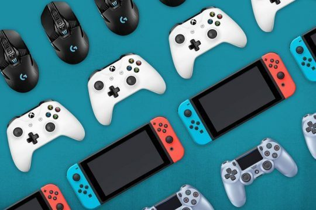
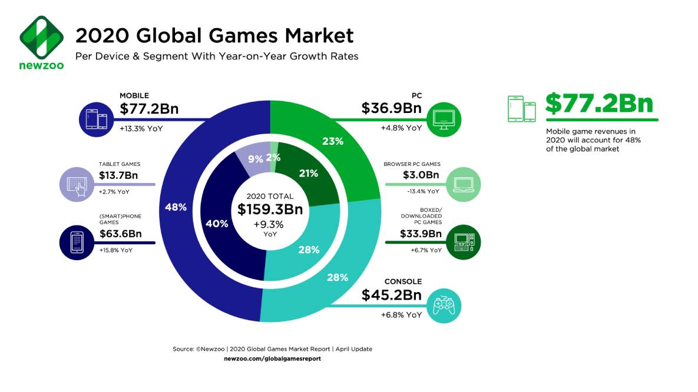
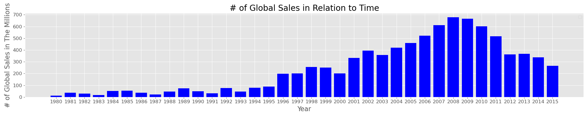
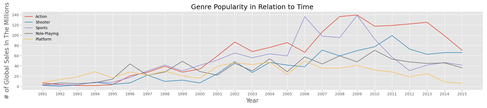
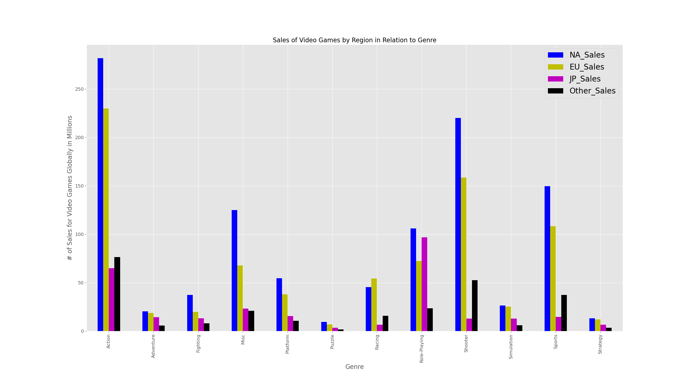
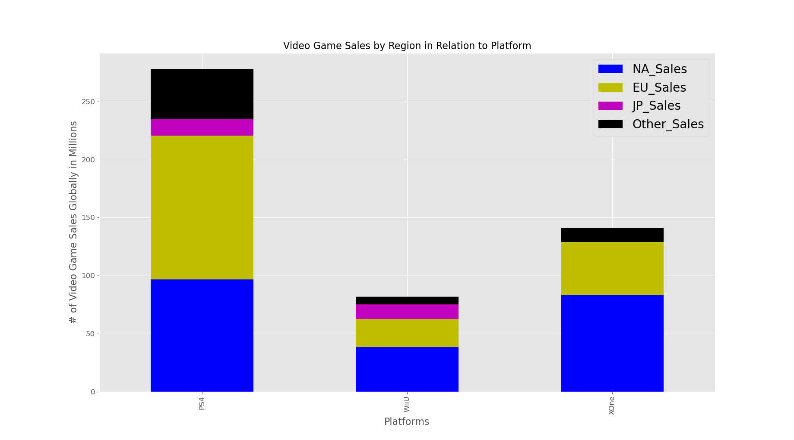
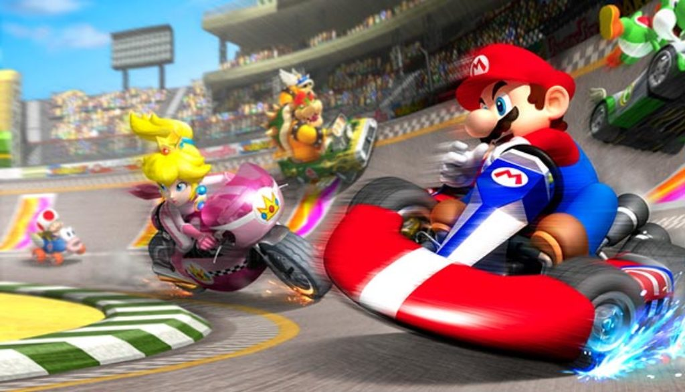

# What Video Game Are You Making?

Capstone 1 Project for Galvanize.

## Overview

 source newzoo.com/globalgamesreport

The video game market has recently become the most lucrative form of entertainment, with an estimated 159.3 billion dollars 
of revenue coming in by the end of this year. This information came as a surprise to me since video games were sort of a shunned activity when I was growing up, always being linked to things such as gun violence and laziness. Since that's apparently done a 180 in terms of how popular they've become, and how mainstream they currently are, I wanted to find out where you should start if you wanted to create a video game developing studio and answer some of the questions that came to mind, such as:
    
    -What genre of game should you make if you're looking to make the most sales?
    -Does any particular genre sell better in certain parts of the world?
    -If you were to take an exclusivity deal, which platform should you choose?

## The Data

|    |   Rank | Name                     | Platform   |   Year | Genre        | Publisher   |   NA_Sales |   EU_Sales |   JP_Sales |   Other_Sales |   Global_Sales |
|---:|-------:|:-------------------------|:-----------|-------:|:-------------|:------------|-----------:|-----------:|-----------:|--------------:|---------------:|
|  0 |      1 | Wii Sports               | Wii        |   2006 | Sports       | Nintendo    |      41.49 |      29.02 |       3.77 |          8.46 |          82.74 |
|  1 |      2 | Super Mario Bros.        | NES        |   1985 | Platform     | Nintendo    |      29.08 |       3.58 |       6.81 |          0.77 |          40.24 |
|  2 |      3 | Mario Kart Wii           | Wii        |   2008 | Racing       | Nintendo    |      15.85 |      12.88 |       3.79 |          3.31 |          35.83 |
|  3 |      4 | Wii Sports Resort        | Wii        |   2009 | Sports       | Nintendo    |      15.75 |      11.01 |       3.28 |          2.96 |          33    |
|  4 |      5 | Pokemon Red/Pokemon Blue | GB         |   1996 | Role-Playing | Nintendo    |      11.27 |       8.89 |      10.22 |          1    |          31.38 |

To answer these questions, I pulled my data from a ['google dataset'](https://data.world/julienf/video-games-global-sales-in-volume-1983-2017/workspace/file?filename=vgsalesGlobale.csv)  which in turn pulled it's information from the website [vgchartz](https://www.vgchartz.com), which tracked the physical global sales for over 16,598 video game releases starting in the year 1978 to the year 2017. It also contains sales per region, the genres of said games, as well as the platform on which it was sold. In terms of cleaning, I was extremely lucky  in terms of my data as there were very few null values narrowed down to two columns. 

First, I want to give a little bit of background on this data before I go and answer these questions. I want to state that the data begins to dip starting in the year 2013. While this looks alarming at first, keep in mind this data only tracked physical sales and the cause of the dip is likely due to the massive rise in digital sales for PC, Console, and Mobile gaming. Although physical purchases have decreased, there's no doubt that global sales for video games overall have been on the rise. So with this in mind I will be focusing on the marketshare for these games and not necessarily the total amount of global sales.

## Most popular video game genres

So onto the first question, what genre of game should you make? As you can see, many genres have risen and fallen over the years. While we can see platformers having a lead in the early 90s, as time has gone on they've struggled to perform as well as the behemoths that are Action games and Shooters. While both of these genres have there ups and downs, they both benefit from being rather flexible with both what their gameplay has to offer, as well as the story narrative you can choose to work with. They also tend to be more accessible than a game within a more niche genre such as sports or role-playing, where both the gameplay and story narrative (If you have one) need to be focused on either the sport itself, or allow you to role-play the exact character you want to be. If you're looking to maximize your sales for your first game, I would highly suggest creating either an action game or a shooter.

## Percentage of sales for each country

You should also know where to market your game depending on the genre you picked. In general, North America seems to always outsell every other part of the world with the EU coming in close second for most sales. This is likely due to how massive North America is, but it's still something to keep in mind. There are two exceptions to this however, Racing games are more popular in EU countries while role-playing games do exceptionally well in Japan outselling the EU and competeing with North America. One thing to keep in mind, even though games such as simulation, strategy, and fighting games don't sell the most boxes, they do hit niche markets that the big genres like shooters and action games may not necessarily hit.

## What platform should you sell your game on?

The final thing to note is deciding which platform your game should have an exclusivity deal with if you choose to do so. As you can see video games on PS4 outsell both of the other consoles combined, so the PS4 should be the first console you try to land a deal with. The Xbox One has an incredibly interesting story to tell as well. If you plan on only selling your game in North America, then PS4 and Xbox One video game sales are relatively similar. However, in EU, Japan, and other parts of the world, Xbox One underpeforms significantly compared to it's counterpart. So if you land a deal for the Xbox One, you're relatively safe to spend the majority of your marketing in North America. This finally brings us to the Wii U which is far below it's other two competitors, I would suggest stearing clear for an exclusivity deal for the WiiU , that is unless they're willing to make up for nearly half the difference in sales you would make with Xbox one or nearly 4 times the sales you would make with Ps4. The same can be said with Xbox one compared to PS4 with nearly double the sales.

## Conclusion
If you were to make a video game company tomorrow, and you wanted to maximize your sales, you wouldn't really have a lot of options when deciding both what game you're making and where you're trying to market it. Clearly Action and Shooter games come out on top in the war against genres, and PS4 dominates the console market. If you're looking at exactly where you should be marketing your game, the safe bet is to spend the majority of your marketing budget in North America, followed by Europe, then Japan, and finally the rest of the world. However, if you're interested in developing a more niche video game to tap into the less contested genres, your options begin to open up more. This allows you to have more creative freedom at the cost of potentially having less sales. But sometimes a little creative freedom is all you need to sell a massive amount of copies.
|    |   Rank | Name                     | Platform   |   Year | Genre        | Publisher   |   NA_Sales |   EU_Sales |   JP_Sales |   Other_Sales |   Global_Sales |
|---:|-------:|:-------------------------|:-----------|-------:|:-------------|:------------|-----------:|-----------:|-----------:|--------------:|---------------:|
|  2 |      3 | Mario Kart Wii           | Wii        |   2008 | Racing       | Nintendo    |      15.85 |      12.88 |       3.79 |          3.31 |          35.83 |

